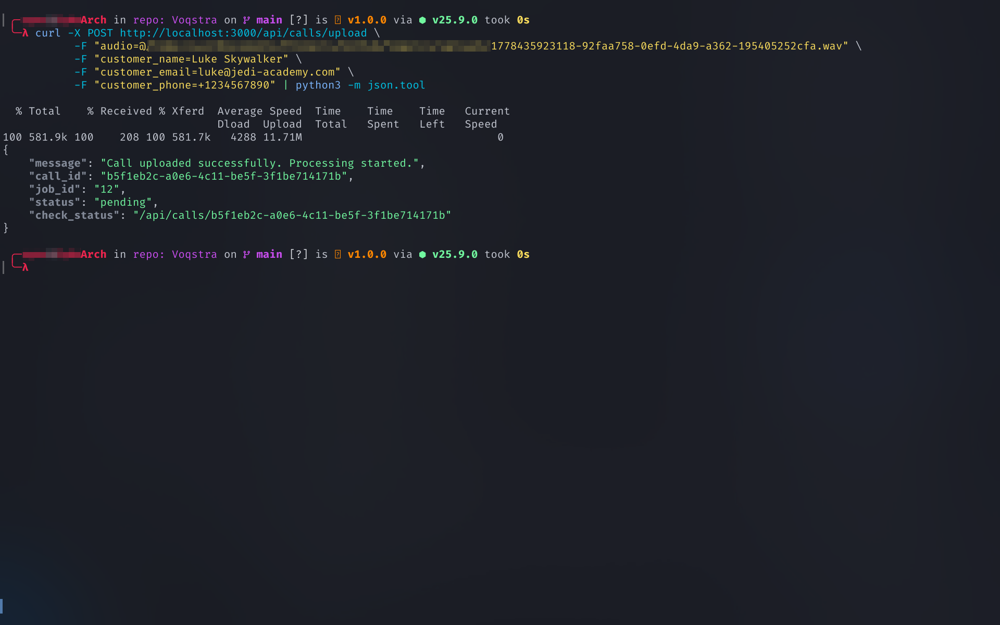
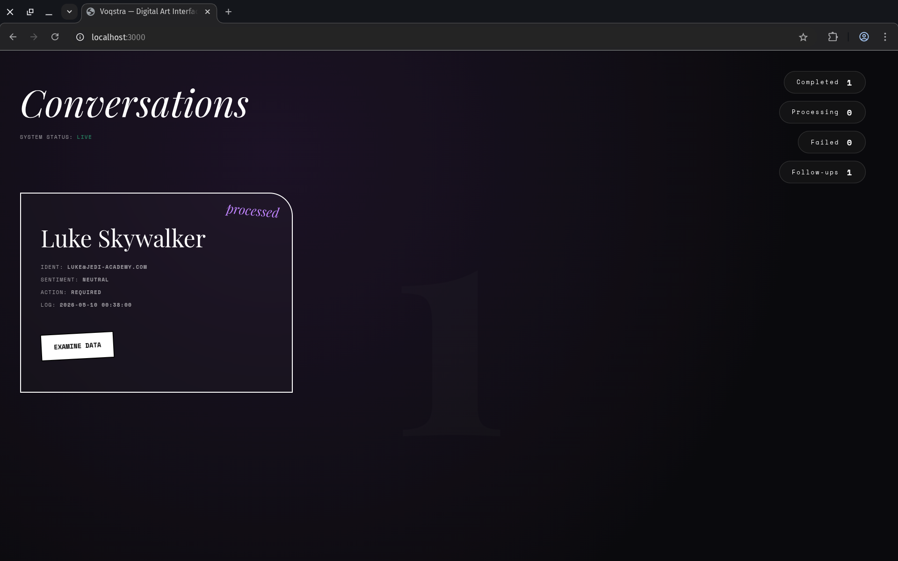
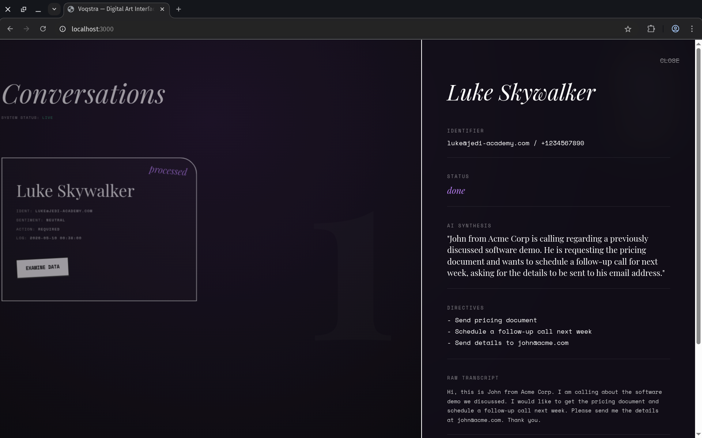
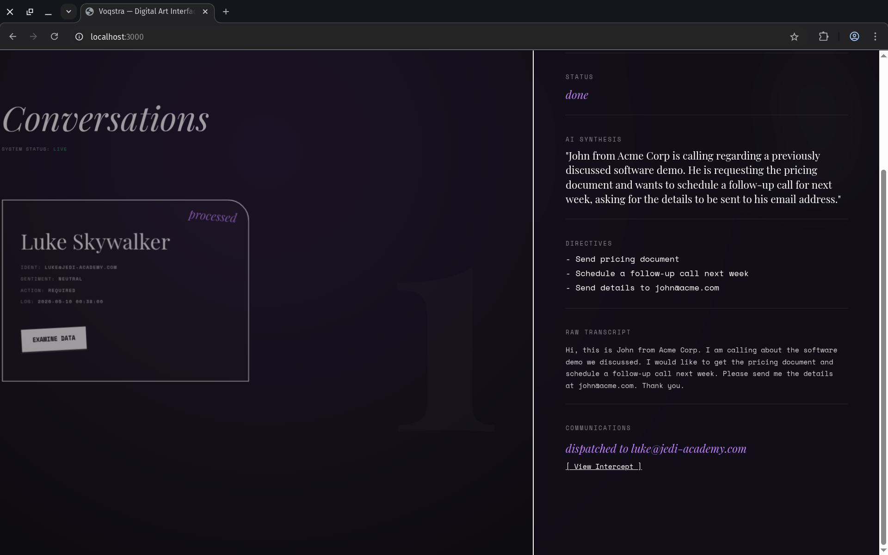
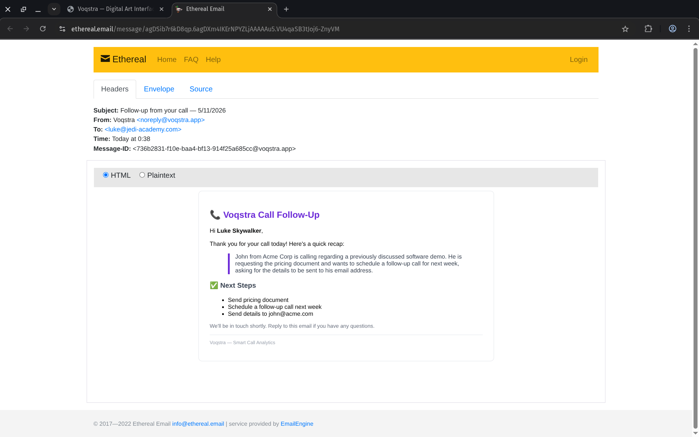

# Voqstra — Smart Call Analytics & Auto-Follow-Up System

> Upload a call recording, transcribe & analyze it with AI, and automatically send a follow-up email based on extracted action items.

[](https://nodejs.org)
[](https://aistudio.google.com)
[](https://postgresql.org)
[](https://redis.io)
[](https://bullmq.io)
[](https://docker.com)

---

## What It Does

1. **Upload** a call audio file (MP3, WAV, M4A, etc.) via REST API
2. **Queue** the job with BullMQ + Redis for async processing
3. **Analyze** with Gemini 2.5 Flash (multimodal inference — one call does transcription + AI analysis)
4. **Store** transcript, sentiment, summary, and action items in PostgreSQL
5. **Auto-send** a follow-up email (via Ethereal test SMTP) if the AI identifies that the call requires a follow-up

---

## Demo Gallery

### 1. Uploading a Call via API


### 2. Main Dashboard (Digital Art UI)


### 3. AI Insights & Transcript (Side Panel)


### 4. Automated Follow-up Dispatch



---

## Architecture

```text
[Audio Upload]
      |
      v
[Express API] --> [PostgreSQL: calls table]
      |
      v
[Redis Queue] --> [BullMQ Worker]
                       |
                       +-- Gemini 2.5 Flash (audio -> transcript + insights)
                       +-- PostgreSQL: call_insights table
                       +-- Nodemailer Ethereal -> messages table
```

---

## Tech Stack

| Component | Technology |
|---|---|
| **Backend API** | Node.js + Express |
| **AI Analysis** | Google Gemini 2.5 Flash API (free tier) |
| **Database** | PostgreSQL 16 |
| **Job Queue** | BullMQ + Redis 7 |
| **Email Service** | Nodemailer + Ethereal Email |
| **Logging** | Winston |
| **Containers** | Docker Compose |

---

## Quick Start

### Prerequisites
- Node.js 18+
- Docker + Docker Compose
- [Google Gemini API key](https://aistudio.google.com)

### 1. Clone & Install

```bash
git clone https://github.com/yourusername/voqstra.git
cd voqstra
npm install
```

### 2. Configure Environment

Copy the example environment file:
```bash
cp .env.example .env
```

Open `.env` and set your Gemini API key:
```env
GEMINI_API_KEY=your_key_here
```

### 3. Start Infrastructure

Start PostgreSQL and Redis via Docker Compose:
```bash
docker compose up -d
```

### 4. Run the Application

You can start the Express API and BullMQ worker together using concurrently:
```bash
npm run dev:all
```

Alternatively, you can run them in separate terminals:
```bash
# Terminal 1 - API server (auto-migrates DB on first run)
npm run dev

# Terminal 2 - BullMQ worker
npm run worker
```

### 5. Access the Dashboard

Open your browser and navigate to:
```text
http://localhost:3000
```

---

## API Reference

### Upload a call recording

```bash
curl -X POST http://localhost:3000/api/calls/upload \
  -F "audio=@sample.wav" \
  -F "customer_name=Jane Smith" \
  -F "customer_email=jane@example.com" \
  -F "customer_phone=+1234567890"
```

**Response:**
```json
{
  "message": "Call uploaded successfully. Processing started.",
  "call_id": "uuid-here",
  "job_id": "1",
  "status": "pending",
  "check_status": "/api/calls/uuid-here"
}
```

### Get call status & insights

```bash
curl http://localhost:3000/api/calls/{call_id}
```

### List all calls

```bash
curl http://localhost:3000/api/calls
```

### Health check

```bash
curl http://localhost:3000/api/calls/health
```

---

## Database Schema

- **calls:** id, customer_name, customer_email, customer_phone, audio_filename, status, created_at
- **call_insights:** id, call_id, transcript, sentiment, summary, action_items (JSONB), needs_followup, created_at
- **messages:** id, call_id, recipient_email, channel, message_body, preview_url, sent_at, status

---

## License

MIT License

---

## Mobile Client (React Native / Expo)

A cross-platform mobile companion client for Voqstra built with **React Native (Expo SDK 57)** and **TypeScript**, designed for field agents and managers to review call insights, sentiment metrics, and queue processing statuses on the go.

### Mobile Features

- **Authentication & Persistence:**
  - Branded login screen matching Voqstra's purple design system.
  - JWT token storage via `@react-native-async-storage/async-storage` with automatic session restore on app launch.
  - One-tap demo credential autofill (`demo@voqstra.app` / `demo123`).
- **Call List Screen:**
  - Real-time list matching PostgreSQL call records.
  - Dynamic **Sentiment Badges** (Positive: green, Neutral: slate, Negative: red) with normalized sentiment scores (`-1.0` to `+1.0`).
  - **Status Chips** (`COMPLETED`, `PROCESSING`, `FAILED`, `PENDING`).
  - Pull-to-refresh (`RefreshControl`) and cache hydration.
- **Call Detail Screen:**
  - Full call metadata (duration, timestamp, customer contact details).
  - AI analysis breakdown: sentiment score gauge, executive summary, and actionable tags.
  - Checklist of extracted AI follow-up action items.
  - Full audio transcript with speaker diarization (`Agent` vs `Customer`) and timestamps.
  - BullMQ background queue live status indicator for actively processing audio jobs.
- **Dual API Mode (Mock & Live):**
  - Works out of the box in **Mock Mode** (`EXPO_PUBLIC_API_MODE=mock`) with realistic call datasets for demonstrations and recruiter review without requiring a running backend.
  - Toggle to **Live Mode** (`EXPO_PUBLIC_API_MODE=live`) to connect directly to the Voqstra Express REST API.

---

### Mobile Tech Stack

| Component | Technology |
|---|---|
| **Framework** | Expo SDK 57 (React Native 0.86.3) |
| **Language** | TypeScript (Strict mode) |
| **Navigation** | React Navigation v7 (Native Stack) |
| **HTTP Client** | Axios (Typed with JWT bearer interceptors) |
| **Storage** | React Native Async Storage |
| **Safe Area** | React Native Safe Area Context |
| **Icons & Design** | Custom Voqstra Design System |

---

### Mobile Directory Structure

```text
mobile/
├── App.tsx                    # App root (SafeArea, Auth, and Navigation providers)
├── index.ts                   # Expo root entry point
├── .env                       # Mobile environment variables
├── package.json               # Expo SDK 57 dependencies
└── src/
    ├── api/
    │   ├── client.ts          # Axios client with request/response JWT interceptors
    │   ├── types.ts           # TypeScript interfaces matching PostgreSQL schema
    │   ├── calls.ts           # Typed API service (mock/live toggle)
    │   └── mock.ts            # Realistic mock call records for standalone testing
    ├── auth/
    │   ├── AuthContext.tsx    # React Context for auth state & session restore
    │   └── storage.ts         # AsyncStorage token & user persistence
    ├── components/
    │   ├── CallCard.tsx       # Interactive card component with sentiment/status
    │   ├── SentimentBadge.tsx # Color-coded sentiment badge with score
    │   └── StatusChip.tsx     # Processing status indicator chip
    ├── navigation/
    │   └── RootNavigator.tsx  # Native stack navigator (auth-guarded routes)
    ├── screens/
    │   ├── LoginScreen.tsx    # Branded login screen with demo button
    │   ├── CallListScreen.tsx # Paginated/pull-to-refresh call list
    │   └── CallDetailScreen.tsx # Comprehensive transcript & analysis view
    └── theme/
        └── colors.ts          # Voqstra purple color palette & styling tokens
```

---

### Mobile Quick Start

#### 1. Navigate to Mobile Directory
```bash
cd mobile
```

#### 2. Install Dependencies
```bash
npm install
```

#### 3. Start Expo Bundler
```bash
npx expo start -c
```

#### 4. Run on Device or Emulator
- **Physical Device:** Open **Expo Go** on Android or iOS and scan the QR code displayed in your terminal.
- **Android Emulator:** Press `a` in the terminal.
- **iOS Simulator:** Press `i` in the terminal.

#### 5. Demo Credentials
Tap the **"Fill Demo Credentials"** button on the login screen, or sign in with:
- **Email:** `demo@voqstra.app`
- **Password:** `demo123`
